## About Me
Hi, I'm Keane Manuel, studying Data Science @ The University of Melbourne, building at the intersection of machine learning and software engineering, with experience in Python, C, C++, SQL, Java, HTML/CSS, and Git/GitHub

## Tech Stack:
           

## Socials:
   

<picture>
  <source media="(prefers-color-scheme: dark)" srcset="https://raw.githubusercontent.com/keanemanuel/keanemanuel/output/github-contribution-grid-snake-dark.svg" />
  
</picture>
